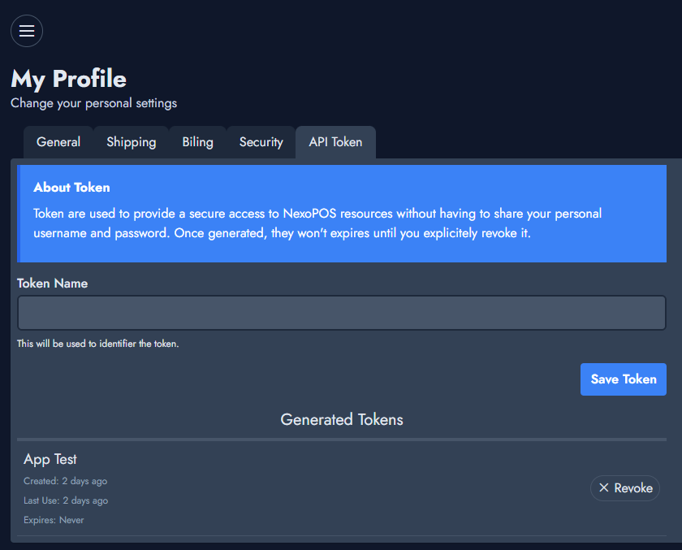

# Authentification

This guide will help you interacting with NexoPOS Rest API. As NexoPOS uses Laravel and Laravel Sanctum,
we'll use this latest to create a secured token. That token will authentify requests and assign all operations
to the users who generated the token. This also means some operations might be restricted if the user who generated the token doesn't have the permission to perform those operations.

## Requirements

In order to interact with NexoPOS API, you need to make sure it's already installed.

## Generating The Token

In order to generate the authentication token, you need to head to the the user profile. From there, you'll see a "API token" tab
which is where we'll generate the token.



Provide any name you find relevant for your token.

## Generate a new site

Generate a new Docusaurus site using the **classic template**.

The classic template will automatically be added to your project after you run the command:

```bash
npm init docusaurus@latest my-website classic
```

You can type this command into Command Prompt, Powershell, Terminal, or any other integrated terminal of your code editor.

The command also installs all necessary dependencies you need to run Docusaurus.

## Start your site

Run the development server:

```bash
cd my-website
npm run start
```

The `cd` command changes the directory you're working with. In order to work with your newly created Docusaurus site, you'll need to navigate the terminal there.

The `npm run start` command builds your website locally and serves it through a development server, ready for you to view at http://localhost:3000/.

Open `docs/intro.md` (this page) and edit some lines: the site **reloads automatically** and displays your changes.
